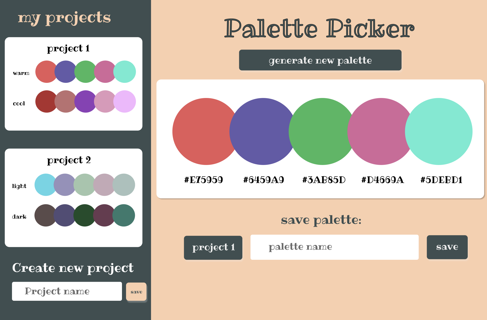
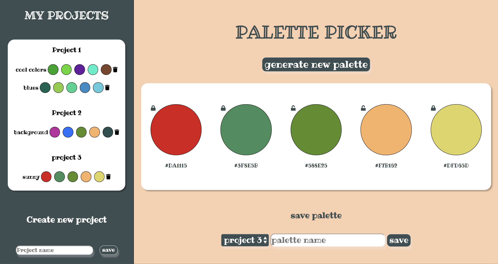

# Palette Picker

## Description
Palette Picker is an application that allows the user to randomly generate a 'palette' of 5 colors, and then save seperate palettes to different project folders. This application utilizes a frontend and a backend.

## Tech
- JavaScript
- HTML, CSS
- Knex
- Express
- PostgreSQL

## Deployment
This application is deployed on heroku and can be viewed here: [Heroku Link](https://cv-palette-picker.herokuapp.com/)

## Design and Layout

### Wireframe

### Live App

